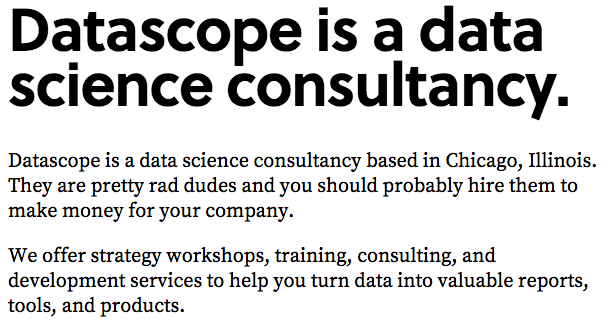

# random other branding notes, to be either developed or destroyed later

Here’s a bunch of use cases and #fonts we looked into using

USE CASE: jumbotron headings on the main website, aka leading sentences

* big, swashy italic serif

    * Tiempos Headline

    * Publico Headline

    * Arnhem

    * Galaxie Copernicus

    * Lyon Display

* cool slab serifs that aren’t too techy

    * 1920s style: Sentinel

    * modern: Foro

    * klinic: like archer and museo had a baby

    * ff tisa: soft yet sharp, modern & bookish

* round sans serif (May be a little too "GE"?)

    * Varela round

    * Brandon Grotesk/Text

    * GT Pressura - not feelin it

    * Museo Sans rounded- nice for headers but don’t love for jumbotron

* sans serifs that are condensed, to contrast with our logotype.

    * Gotham condensed or Gotham X-Narro

USE CASE: secondary headers on the website

USE CASE: level 3 text on the main website. this might be a paragraph long but will still be bigger/different than...

USE CASE: extended body text. blog posts, proposals, case studies, etc

* modern digital-friendly serifs and slab serifs 

    * Skolar

    * FF avance

    * FF Tisa 

        * 

    * Source Serif (more of a transitional, but it’s nice)

        * 

    * Roboto Slab

        * 

    * Sentinel ScreenSmart

        * 

    * Tiempos Text 

    * Fedra Serif

* legible grotesks with some character (read: not Helvetica) 

    * Cooper Hewitt 

        * 

    * Source Sans Pro 

        * 

    * Trade Gothic

        * 

    * Roboto

        * 

    * Gotham Narrow

    * Colfax

    * Atlas Grotesk

    * Encode Sans

    * Benton Sans

    * Bureau Grot

    * Armitage

We may also make handwriting fonts for each employee, using paintfont.com

// other shit:

elite + doesn’t take itself too seriously = swagger

identity needs to be:

fun

creative

unique

contemporary

professional

solid

varied

frank

punctuate things. because that’s just how we roll.

