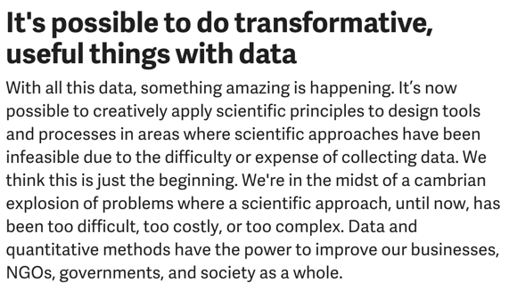
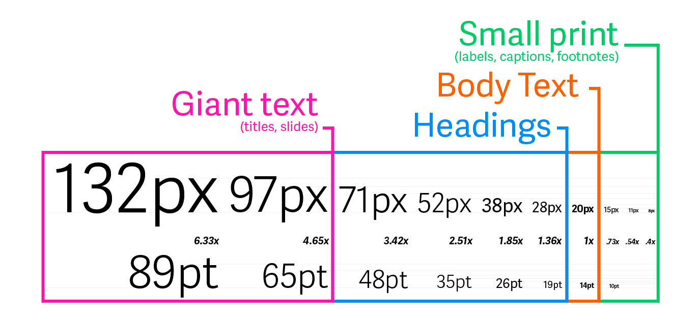
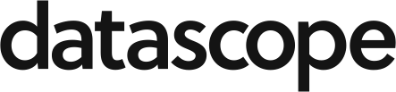
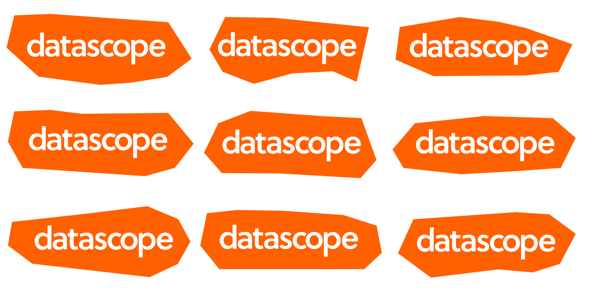
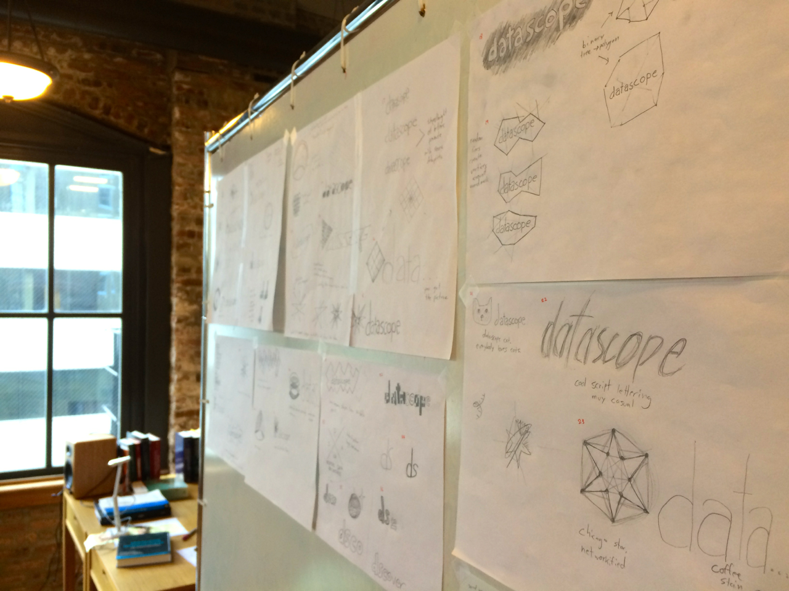
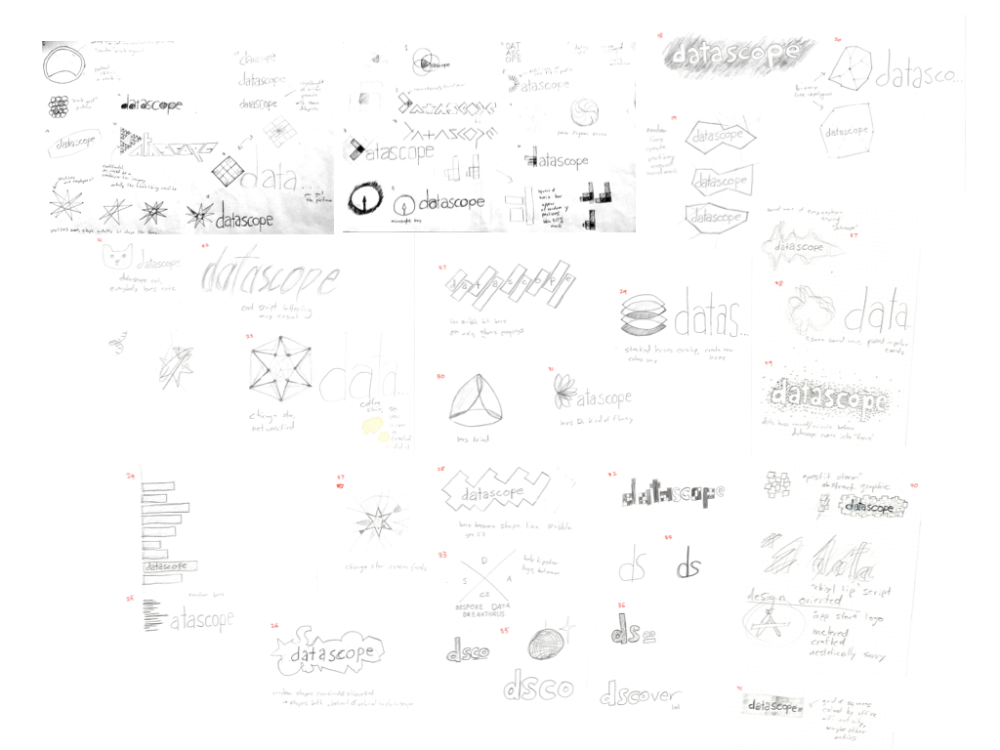
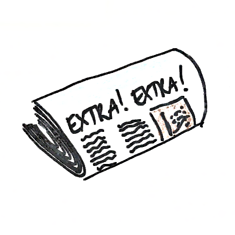
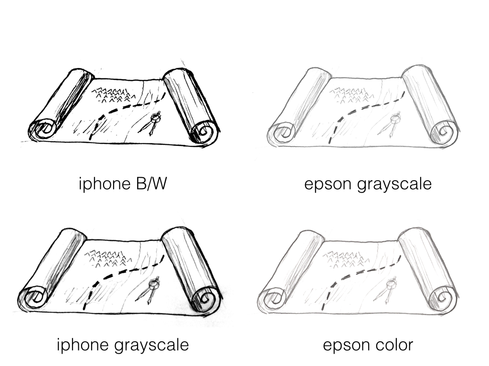
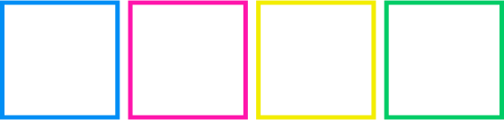

# *Representing Datascope*
# Table of Contents
<!--TOC-->
<!-- Note: the above snippet expands into a table of contents when rendered using Marked -->
# Brand DNA

## LOL, what’s "Brand DNA"?

Datascope’s "brand", from our logo to our colors to our copy, should represent who we are and what it’s like to interact with us at our best — whether as a client, employee, meetup member, partner, or even friend or family member. To do this, we have to start with defining what that means. 

These 9 words represent clusters of words that the Marketing Doodie came up with in an intense brainstorm and discussion in June 2014.

## What do I do with it?

These values can be a good litmus test to see if something is "Datascopey" or not. Take them into consideration in your visual design, writing, speaking, and other communications that represent Datascope.

This **doesn’t **mean you should start writing website copy or blog posts about how diverse, generous, and unique we are. Lots of companies say these things, but saying it doesn’t make it true, and it can come across as disingenuous. Instead, *strive to do work that proves at least some of these values*, and at a minimum doesn’t actively oppose them.

Here we go, in no particular order.

## **Datascope...**

### is novel

Datascope is a new kind of company. We exist in the emerging field of data science, solving problems in unique and sometimes unconventional ways.

associated words: exciting, unique, a rocketship, rising, newsworthy, new, unconventional, young, changing

### is heterogeneous

Datascope brings together great minds with diverse backgrounds, perspectives, and areas of expertise. It’s a comfortable place to work for all sorts of people.

associated words: multidisciplinary, diverse, widely experienced

### is design-oriented

Datascope borrows processes from the design world, creatively generating multitudes of ideas and iteratively refining them into polished prototypes. We put effort into the aesthetics of everything we make and do, but never at the expense of function.

associated words: beautiful (our work, that is), tasteful, designers, creative, energetic

### is dependable

Datascope doesn’t make its clients worry. We communicate professionally and honestly and work hard to get things done on time. We’re responsible with our clients’ data, time, and money.

associated words: responsible, reliable, professional, dependable, hardworking, go-getting, midwestern

### is elite

Datascope is the cream of the crop. The things we make and do are on the cutting edge of data science, and we communicate better than anyone else. To be a Datascoper is an impressive accomplishment.

associated words: super smart, top tier, excellent, on the cutting edge, authoritative, experts, best in the business, great communicators (better than our clients), badass

### doesn’t take itself too seriously

Datascope isn’t one of those stuffy, self-important companies. We’re down to earth and we like to joke around. We’d like to think you’d enjoy having a beer with us.

associated words: funny, fun, cool (but not douchey), a good sense of humor, down to earth, approachable, relaxed, not stuffy, friendly, people you could have a beer with, irreverent, midwestern

### is value-focused

Datascope is savvy to how the work we do fits into the bigger picture of our clients’ business. We want to solve real problems (not merely "interesting" things) and give our clients all the necessary information to be confident making decisions based on our analysis.

associated words: focused on delivering value, not going to work on something useless, pragmatic, business savvy, no bullshit, big picture thinking, not the nerds in the back room, rigorous, honest

### is generous

We give our time, attention, and talents to Chicago, the data science community, and to Datascopers past, present, and future. We are socially conscious when choosing problems to solve.

associated words: beneficent, good people, socially conscious

### is intellectually curious

Datascope loves having collegial arguments about interesting topics. We’re skeptical, like answering questions and aren’t afraid to "show our work."

associated words: interesting people, a team with inspiring colleagues, argumentative (in a friendly way), open, transparent, collaborative, collegial, skeptical, teachers, the best place for a data scientist to work, nerd heaven, fun to work with

TODO: talk about the values that are in tension with each other, and how to reconcile them

# Messaging

to be developed. For now, see [The Message of Datascope](https://docs.google.com/a/datascopeanalytics.com/document/d/1eYc8rZNgh2JGhWSFY5Pp7yPhv6yV4WAAb9pKAt-7jrE/edit).

# Typography

p(these standards change significantly) = .15*Adelle Sans, being awesome*

Our workhorse font is **Adelle Sans**. Adelle Sans is a "grotesk" sans-serif, readable in many contexts while still maintaining a cheerful and quirky character. For use on the web, you can use our company Typekit account (talk to Mike). For use elsewhere, install the fonts to your computer using the files on Dropbox in [/Library/Fonts](https://www.dropbox.com/sh/xnrynkdx48jillj/AAD_pnfDEBTaPtXLuK2IeAD9a?dl=0).

## All the Font Sizes You’ll Ever Need

Just use these. They’re sized proportionally to ratios inherent to the font and are good defaults. Point sizes are for printed documents, while the multipliers and pixel sizes are for the web. 

**Use the "Light" weight of Adelle Sans for body text, and the other weights elsewhere.** It also has some sexy italics.

If you’re a nerd and you *must* know, the ratio between sizes is 1.36 and is based on the difference between the font’s cap height and x-height (see the gray lines on the diagram above).

## Our Logo Font

*The wordmark is set in Soleil, by TypeTogether, but you don’t really need to know that. We’re not planning on using that font anywhere else, and in fact, other fonts we use should strive to be different than Soleil so as not to clash.*

# Logos

p(these standards change significantly) = .2

## The Jaggagon (irregular polygon) generative design is the current logo:

The logo is currently being generated using Paper.js (a badass javascript vector drawing library). Code is [here](https://github.com/datascopeanalytics/logo), a live working generator is [here](http://datascopeanalytics.github.io/logo/). It still needs some work, but you get the idea.

## Process

The Datascope logo was created through an extensive iterative design process. Over the course of a couple months, Marketing Doodie members created over 60 sketched ideas, and narrowed them to 8 favorites.

# Graphic elements

p(these standards change significantly) = .5

## Hand-drawn sketches

Need some visuals? Draw them! Bad at drawing? Doesn’t matter! These sketches are more approachable and punk rock than just plopping in photographs or flat icons.

Some tips:

* For now, let’s try sketches without color. We reserve the right to add color later.

* Since the rest of our identity is pretty flat already, try to add some dimension to the things you draw to help them pop. Think of these as representations of tangible objects rather than icons.

* TODO: We’re still figuring out what the best tools to draw with and sizes to draw things at are. We’ll fill this in when we have more experience.

## Jaggies.

## 

Think of these as different colored laser beams, bouncing across the page. They should always be relatively thin like above, and should span the width or height of whatever you’re applying them to (aka, don’t make them islands).

We’re still figuring out the details on how these will be used, but they’re unique, Datascope-y, work in a variety of colors, and are generally v.nice. More details to follow once we figure out how they can best be used.

# Color

p(these standards change significantly) = .25

*"...independent of harmony rules, any color ‘goes’ or works’ with any other color, presupposing that their quantities are appropriate." - Josef Albers, Interaction of Color*

Similar to the logo, the color palette was iteratively contributed to by multiple Datascopers. The goal was to make the palette more diverse, unique, and high-energy while preserving a smidge of continuity via the orange.

This palette is in v5 and still being iterated on. You can see all the past iterations and add your own comments [here](https://docs.google.com/a/datascopeanalytics.com/document/d/1k8sbFEijIr44-bcOV7MXPFUeLRJP0y2o-BsCghQPKsc/edit). 

## Behold, the palette!

[Illustrator swatches](https://www.dropbox.com/s/m2zpo0vr9c6lvr7/datascope_colors.ai?dl=0)

**Datascope Orange (aka "First Tangerine to Die")**

**#ff6000 • rgb(255, 96, 0)**

Use me for representing Datascope using a single color. Good places to use me: the logo

I don’t look so great when butted right up against our dark neutral— tends to be Halloweeny.

### Accent Colors:

Use us for adding pops of color to your designs. We’re pretty opinionated, so either use us extremely sparingly (like the 5px borders below), or go big with just one of us.

**Blue** (aka "Arctic Azimuth Azure") - **#****008EF5 • rgb(0, 142, 245)**

**Magenta** (aka "Bruiser Woods") - **#****FF15AB • rgb(255, 21, 171)**

**Yellow** (aka "Limoncello Devito"[*](https://www.youtube.com/watch?v=hzpu5EES8pE)) - **#F3ED00 • rgb(243, 237, 0)**

**Green** (aka "Paris on Prozac" ) - **#00CC66 • rgb(0, 204, 102)**

### Neutral Colors:

We may be boring, but damn if we aren’t useful. The majority of your designs should be made up of us.

**White (aka… white)**

**#FFFFFF**

Use me as your background color for most things. I know I’m a little plain, but you can put hand-drawn sketches on me and they won’t look like shit. Also, I’m printer friendly.

**Gray (aka... needs a good name)**

**#DDDDDD**

I’m for when you need something de-emphasized and there’s no other easy way to do it. Most of the time my parents White and DNB make for a cleaner, higher-contrast look, but sometimes you just need a nice gray.

**Damn Near Black**

**#141414**

The literal yin to White’s yang, I’m good for foreground elements like text. Occasionally if you need to flip the script, I can be a background and White can become the foreground color.

**_Rumor has it White and DNB may have more children soon, but they’re thinking very hard about how many they need and for what purpose._**

## What about if I’m printing something professionally?

We’re well aware that many of these colors are not reproducible in CMYK— worthy alternatives or Pantone colors will come later. (who the hell prints physical things anymore anyway?)

# Copy Style

I don’t really know where to start with writing guidelines for this. Would like to do some reading on the subject, and/or hire somebody.

Related: this is really cool: [http://voiceandtone.com/guide/](http://voiceandtone.com/guide/)

